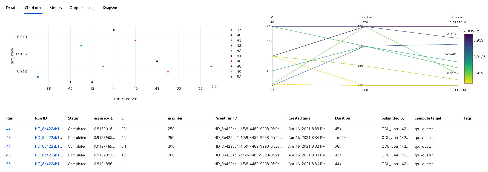
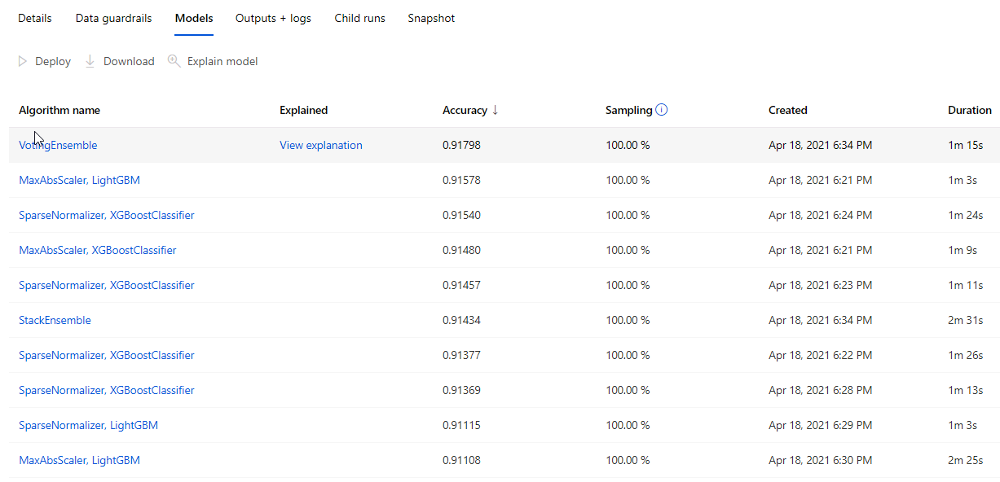

# Optimizing an ML Pipeline in Azure
## Overview
This project is part of the Udacity Azure ML Nanodegree.
In this project, we build and optimize an Azure ML pipeline using the Python SDK and a provided Scikit-learn model.
This model is then compared to an Azure AutoML run.

## Summary
The used [`Bank Marketing Dataset`](https://archive.ics.uci.edu/ml/datasets/Bank+Marketing) is related with direct marketing compains of a Portuguese banking institution. The marketing compains were based on phone calls. The data highlights if `yes` or `No` a certain product (bank term deposit) has been subscibed to by a client.

We seek in this project to classify whether a certain client will subcsribe to a term deposit. The output label given in the last column `y` holds all the decisions made by different clients. The feature vectors described by the remaining columns holds the attributes of the bank clients, ranging from age, job, to marital status, housing loan, ...etc

In order to achieve this, two approches for building our model are described. Hyperdrive tunning and AutoML. For the HyperDrive tunning experiment we achieved an accuracy of `0.9132` with the best performing model. One the other hand for AutoML, the results were very close with `0.9178`.


## Scikit-learn Pipeline
### Pipeline architecture 
The pipeline architecture is described in the diagram below. 


For the HypyDrive part, we use a `train.py` python file that loads the csv marketing data file into a Tabular dataset before performing a logistic regression training with Scikit-learn. The tunning parameters are given by C and max_iter, such that  
>* C is defined as the inverse of regularization, that is high values will result in smalled regularization
>* max_iter: is the maximum number of iteration to converge.

The HyperDrive experiment is orchestrated in a jupyter notebook hosted in a compute instance. Note that in the HyperDrive config file we specify the train.py file that is used for the purpose of performing the logistic regression training for each assigned hyperparameter. 

### Classification algorithm 
1. First the csv dataset is loaded with the `TabularDatasetFactory` function using its URL.
2. Data cleaning and Onehot encoding is performed with the `clean_data` function
3. The data is split into a training and a test set using the scikit-learn function `train_test_split`
4. Allowing hyperparameter parsing
5. The LogisticRegression function from scikit-learn library is used for training
6. Saving the trained model as a joblib file.

## HyperDrive Tunning
After creating the experiment and the workspace, we create a cluster instance to run our experiment and we make sure to continue if the latter already exist. we start with the ScriptRunConfig to let HyperDrive know which training file it needs to use, we can also specify a certain environment with its spcecific packages to run the scikit-learn logistic regression in Azure. We also need to specify the source directory that is holding our train.py file and finally the `Bandit` termination policy.

```python
est = ScriptRunConfig(source_directory = '.',
                      script = 'train.py',
                      compute_target = compute_target,
                      environment = sklearn_env)
```
We need after to specify the parameter sampler as follows 
```python 
ps = RandomParameterSampling({
    "C": choice(0.01, 0.1, 1, 10, 20, 40),
    "max_iter": choice(100, 150, 200, 250)
})
# Specify a Policy
policy = BanditPolicy(evaluation_interval=2, slack_factor=0.1)
```

### Benefits of the parameter sampler
Hyperparameter sampler can generate discrete or continuous values, and has a distribution of values described by a parameter expression. parameter sampler allows us to explore various models in order to eliminate bias and increase the accuracy. 

### Benefits of the early stopping policy
The early stopping policy simply terminate poorly performing runs to save compute ressources. The bandit policy just terminates any run that doesn't fall within the slack factor of the evaluation metric with respect to the best performing run. evaluation interval defines the frequency for applying the policy. The slack factor is just a percentage of the best run, below wich we cancel the run. 

```python 
# Create a HyperDriveConfig using the estimator, hyperparameter sampler, and policy.
hyperdrive_config = HyperDriveConfig(run_config = est,
                                    hyperparameter_sampling = ps,
                                    policy=policy,
                                    primary_metric_name = 'accuracy',
                                    primary_metric_goal = PrimaryMetricGoal.MAXIMIZE,
                                    max_total_runs = 20,
                                    max_concurrent_runs = 4)
```
Note that our primary metric that we are trying to maximize is the accuracy. One can also see that it is calculated in `train.py`.

Finally we submit the experiment.
```python
# Submit your hyperdrive run to the experiment and show run details with the widget.
hdr = exp.submit(config= hyperdrive_config)
hdr.wait_for_completion(show_output=True)
```

The best model was found with the following hyperparamters

```python
{'Regularization Strength:': 20.0, 'Max iterations:': 250, 'accuracy': 0.9132018209408195}
```

----
# AutoML Pipeline 
As you can see it in the above diagram the AutoML pipeline does not require the use of external train.py and the autoML experiment can be fully orchestrated in the jupyter notebook. 

## Load and clean the data
* As we've done previously we load the data into a tabular form
* Use the clean_data function for data cleaning 
* join the features and the output label 
* split the cleaned data into `train_data` and `test_data`

##  Dealing with Tabular dataset
Note that AutoML can only use pandas dataframe locally (Tabular dataset needs to be used with AutoML).

However, in a compute cluster, if we have a pandas dataframe and we are interested in using it with AutoML, it is important to:

1. transform the dataframe into tabular dataset
2. this can not be done directly, the other way around is straightforward as we have seen it in the train.py file
3. Transform the dataframe -> CSV file, then from CSV file -> Tabular dataset

```python 
from pathlib import Path
Path("./data").mkdir(parents=True, exist_ok=True)
train_data.to_csv('./data/train_data.csv', index=False)
```
### Create a dataset referencing 

```python 
from azureml.core import Dataset
# get the datastore to upload prepared data
ds = ws.get_default_datastore()
# upload the local file from src_file to the target_path in datastore
ds.upload(src_dir='./data', target_path='bankmarketing', overwrite=True, show_progress=True)
# create a dataset referencing the cloud location 
train_data= Dataset.Tabular.from_delimited_files(path=ds.path('bankmarketing/train_data.csv'))
```
Before launching AutoML we need configure the following settings:
```python
automl_settings = {
    "n_cross_validations":5,
    "primary_metric": 'accuracy',
    "experiment_timeout_minutes":30,
    "enable_early_stopping": True,
    "compute_target": compute_target,
    "debug_log": "automl_errors.log",
    "max_concurrent_iterations": 4
}
automl_config = AutoMLConfig(task = "classification",
                             training_data=train_data, 
                             label_column_name = "y",
                             iterations=30,
                             iteration_timeout_minutes=5,
                             **automl_settings)
```



We can observe that the `Voting ensemble` model gives us the best predictions. Voting esembles combines different machine leanring classification algorithms and uses the hard voting classifier (or what is known as hard voting classifier). In contrast to soft voting that takes the average over all individual classifiers predicted probabilities.


 


## AutoML
**In 1-2 sentences, describe the model and hyperparameters generated by AutoML.**

## Pipeline comparison
**Compare the two models and their performance. What are the differences in accuracy? In architecture? If there was a difference, why do you think there was one?**

## Future work
**What are some areas of improvement for future experiments? Why might these improvements help the model?**

## Proof of cluster clean up
**If you did not delete your compute cluster in the code, please complete this section. Otherwise, delete this section.**
**Image of cluster marked for deletion**
